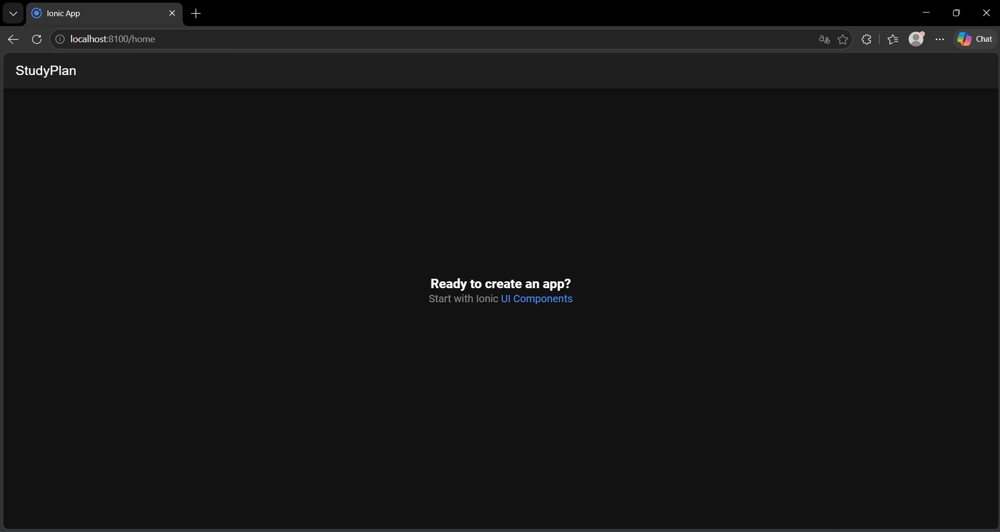

# Semana 6 · Ionic React

## Pasos realizados

1. Se verificó la instalación de Node.js y npm.

2. Se instaló Ionic CLI con:

```bash
npm install -g @ionic/cli
```

3. Se creó el proyecto Ionic React con:

```bash
ionic start miApp blank --type=react
```

4. Se ejecutó el proyecto con:

```bash
ionic serve
```

5. Se cambió el título de la pantalla inicial de `Blank` a `StudyPlan`.

## Captura

